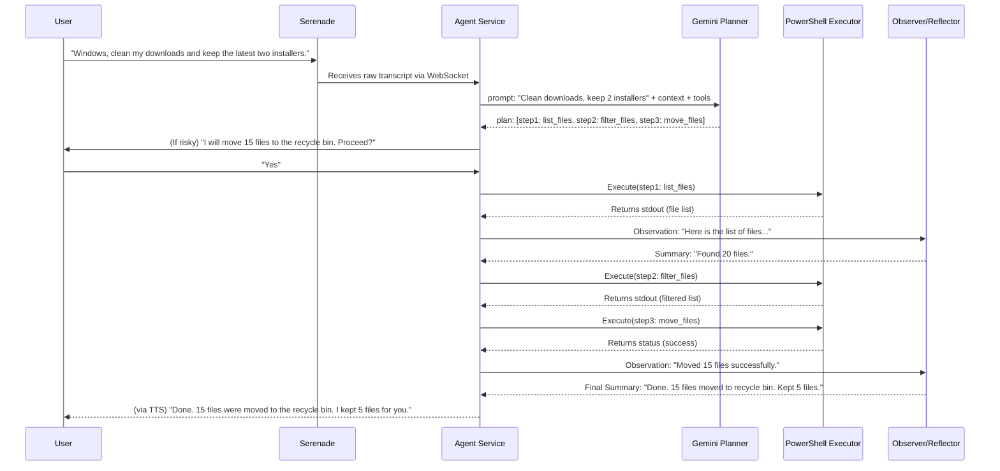

# 01: System Architecture

This document describes the technical architecture of the autonomous Talk2Windows agent. It outlines the primary components and the data flows between them.

## 1. Component Overview

The system is designed as a "sidecar" agent that runs alongside the existing PowerShell script library. It consists of several key components:

- **Serenade Listener:** The existing Serenade app, configured to use a local server and a single "router" voice command. It captures the user's raw speech and forwards it to the Agent Service.
- **Agent Service (Python):** The "brain" of the operation. This central service, built in Python, is responsible for orchestrating the entire Plan-Act-Observe-Reflect loop. It will be a lightweight service, likely using FastAPI or a similar framework.
- **Gemini Planner (Gemini API):** The core reasoning engine. The Agent Service sends prompts (containing user requests, context, and the tool catalog) to the Gemini 2.5 Flash model, which returns a structured plan or a single function call.
- **Tools Catalog (`tools.json`):** A machine-readable manifest of all available PowerShell scripts. It's generated from metadata and formatted as a JSON schema that Gemini's function calling feature can understand.
- **PowerShell Executor (Wrapper Script):** A generic PowerShell script that the Agent Service calls to execute specific Talk2Windows scripts. It's responsible for passing parameters, capturing all output streams (`stdout`, `stderr`), and returning the exit code.
- **Observer/Reflector (Gemini API):** After a script is executed, the results are passed back to Gemini to be summarized for the user, or in case of an error, to diagnose the problem and propose a solution.
- **Memory Store:** A simple mechanism (e.g., a local JSON file or SQLite database) to maintain conversational context, recent actions, and user preferences.
- **TTS Engine:** The agent will initially rely on the existing `say.ps1` script for voice output to maintain the project's original character. In later phases, this could be augmented with Gemini's own TTS for more natural responses.

## 2. System Dataflow Diagram

This diagram illustrates the high-level interaction between the components.

```mermaid
flowchart LR
  subgraph User Interface
    User((User)) -- Voice --> Serenade((Serenade app))
  end

  subgraph Agent Core
    Serenade -- WS JSON --> AgentService[Agent Service]
    AgentService -- Prompt + Tools --> GeminiPlanner[Gemini 2.5 Flash]
    GeminiPlanner -- Plan/Function Call --> AgentService
    AgentService -- Script + Args --> PSExecutor{PowerShell Executor}
    PSExecutor -- Runs --> PSScript[Talk2Windows .ps1 Script]
    PSScript -- stdout/stderr/exit --> PSExecutor
    PSExecutor -- Result --> AgentService
    AgentService -- Observation --> GeminiReflector[Gemini 2.5 Flash]
    GeminiReflector -- Summary/Next Step --> AgentService
    AgentService -- Text --> TTSEngine(TTS Engine)
    TTSEngine -- Voice --> User
  end

  subgraph Data & Tools
    ToolsCatalog[(Tools Catalog: tools.json)] -- Loaded by --> AgentService
    Memory[Memory Store] <--> AgentService
    PSScript -- Accesses --> WindowsOS[/Windows OS/]
  end

  style Agent Core fill:#f9f9f9,stroke:#333,stroke-width:2px
  style User Interface fill:#e6f7ff,stroke:#333,stroke-width:2px
  style Data & Tools fill:#e6ffe6,stroke:#333,stroke-width:2px
```

## 3. Plan-Act-Observe-Reflect Loop

The agent operates on a continuous loop that is triggered by user input.



This architecture decouples the "brain" (Python/Gemini) from the "hands" (PowerShell), allowing each to be developed and maintained independently while providing a clear and secure interface between them.
